# Bevy Regolith - Architecture Diagrams

## System Flow Diagram

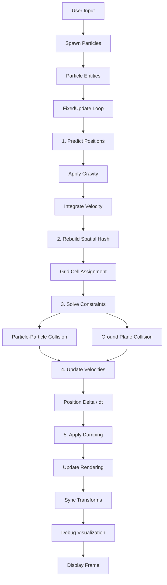

## Component Architecture

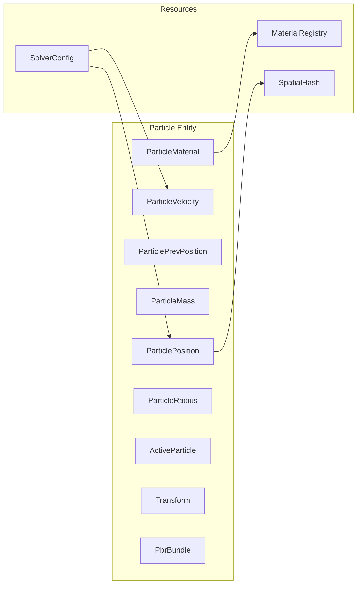

## PBD Solver Pipeline

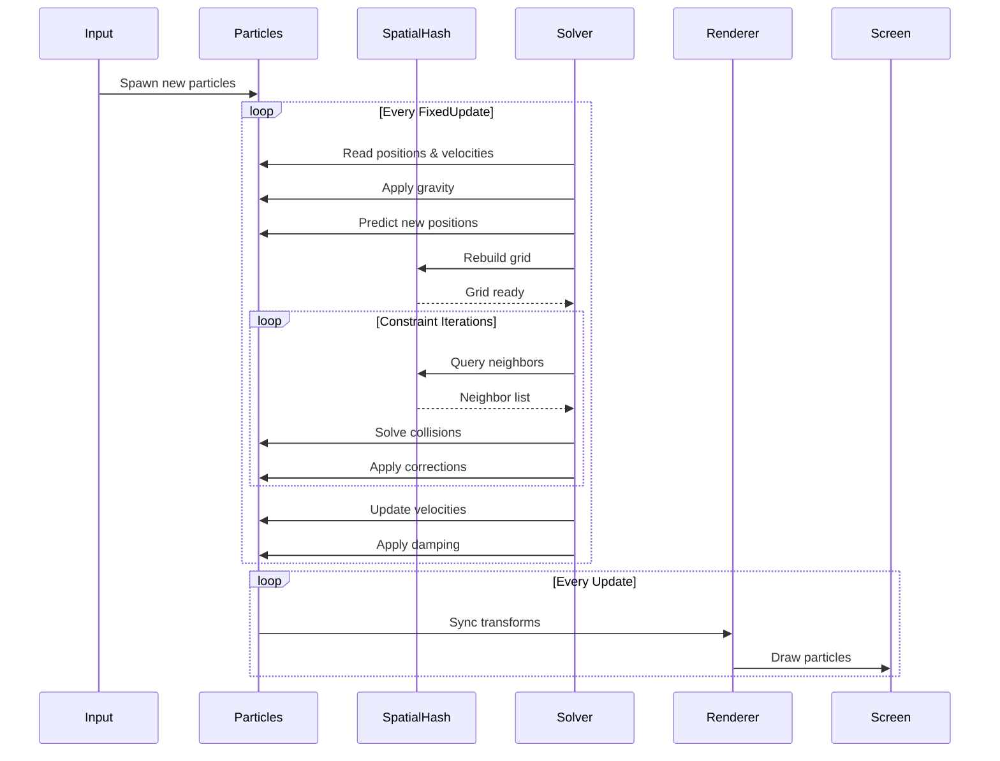

## Spatial Hash Structure

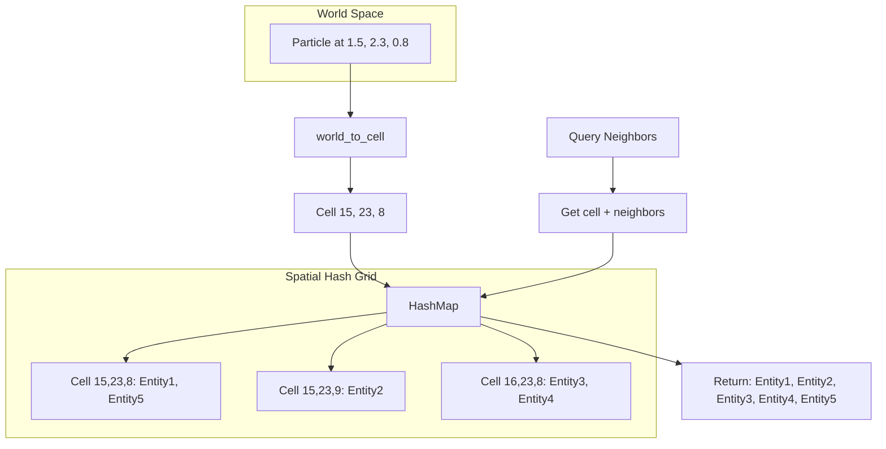

## Material System

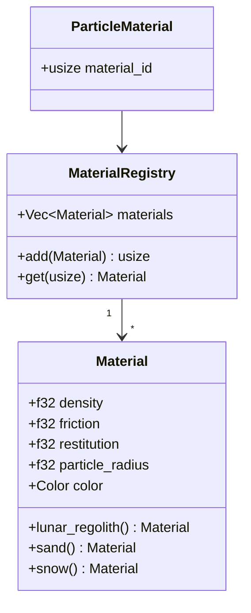

## Collision Detection Flow

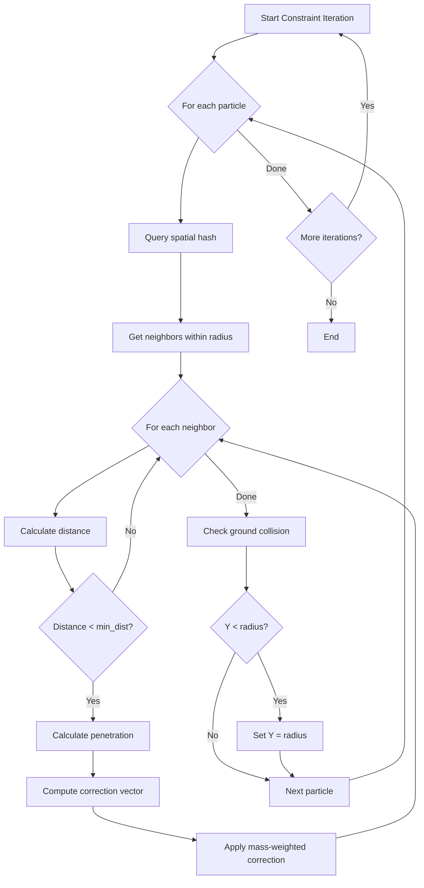

## Data Flow: CPU to GPU Migration

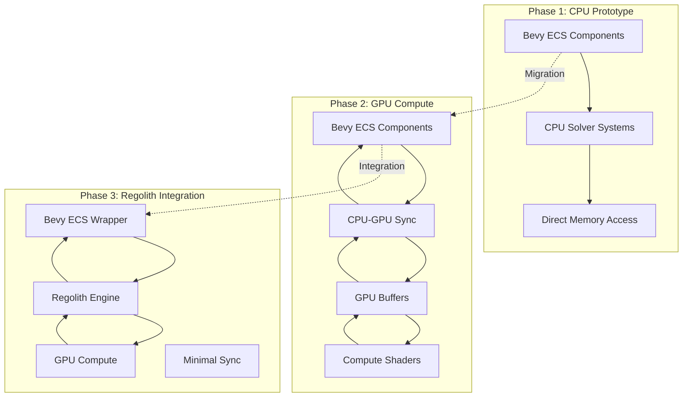

## Performance Comparison

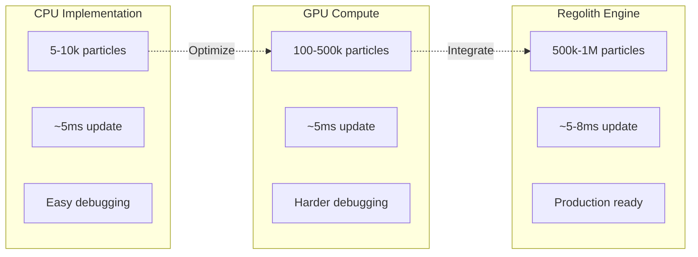

## Rigid Body Interaction

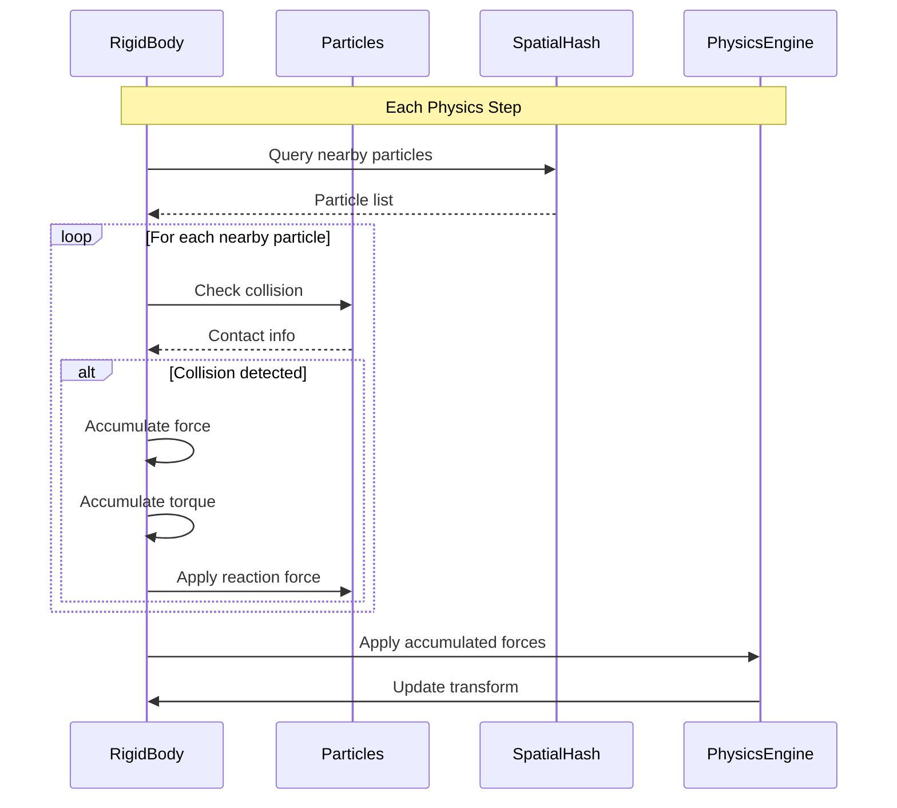

## Camera System

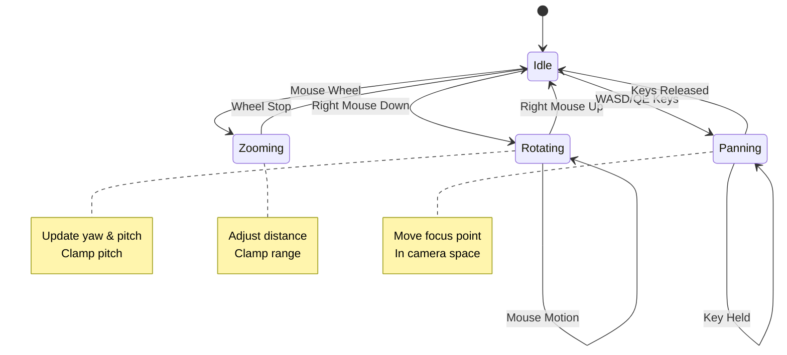

## Debug Visualization Layers

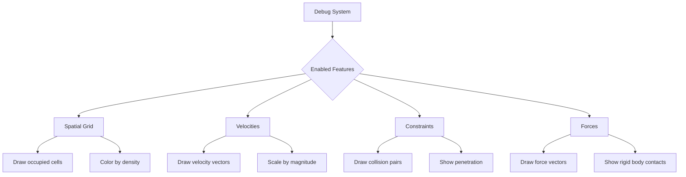

## Module Dependencies

```mermaid
graph TD
    A[lib.rs] --> B[particle.rs]
    A --> C[material.rs]
    A --> D[spawner.rs]
    A --> E[solver.rs]
    A --> F[spatial.rs]
    A --> G[collision.rs]
    A --> H[rendering.rs]
    A --> I[camera.rs]
    A --> J[ui.rs]
    A --> K[debug.rs]
    A --> L[rigid_body.rs]
    
    D --> B
    D --> C
    
    E --> B
    E --> F
    
    G --> B
    G --> F
    G --> C
    
    H --> B
    H --> C
    
    K --> F
    K --> B
    
    L --> B
    L --> F