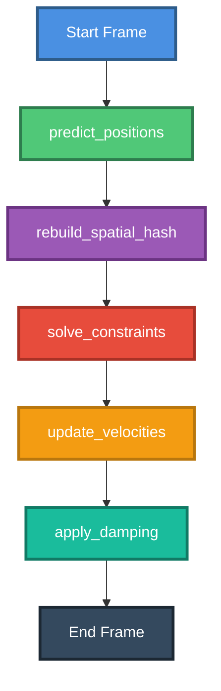

# How the Solver Works in Bevy Regolith

This code implements a **Position-Based Dynamics (PBD)** solver for granular physics simulation. Here's a comprehensive breakdown:

## Overview

The solver uses a **predict-solve-update** cycle that runs at a fixed timestep (default 60 FPS). This is a constraint-based physics approach where positions are directly manipulated to satisfy constraints, rather than using force-based integration.

## Architecture Diagram



## Solver Pipeline (FixedUpdate)

The solver executes these systems in sequence every physics tick:

### 1. **Predict Positions** ([`predict_positions()`](src/solver.rs:43))

```rust
// Store current position
prev_pos.0 = pos.0;

// Apply gravity
vel.0 += config.gravity * config.dt;

// Predict new position
pos.0 += vel.0 * config.dt;
```

**What it does:**
- Saves the current position as "previous position" (needed for velocity calculation later)
- Applies gravity acceleration to velocity: `v = v + g·Δt`
- Uses semi-implicit Euler integration to predict new position: `x = x + v·Δt`

**Key insight:** This is a *prediction* - the actual position will be corrected by constraints.

### 2. **Rebuild Spatial Hash** ([`rebuild_spatial_hash()`](src/solver.rs:64))

```rust
spatial_hash.rebuild(&particles);
```

**What it does:**
- Updates a spatial grid data structure that divides 3D space into cells
- Allows efficient neighbor queries (O(1) instead of O(n²))
- Essential for collision detection between nearby particles

### 3. **Solve Constraints** ([`solve_constraints()`](src/collision.rs:8))

This is the heart of PBD. It runs for multiple iterations (default 5) to satisfy constraints:

```rust
for _ in 0..config.iterations {
    // Particle-particle collisions
    for each particle {
        query neighbors within radius * 3.0
        
        for each neighbor {
            if overlapping {
                // Calculate penetration depth
                penetration = (r1 + r2) - distance
                
                // Mass-weighted correction
                correction = -direction * penetration * weight * 0.5
            }
        }
    }
    
    // Ground plane collision
    if particle.y < radius {
        particle.y = radius
    }
}
```

**What it does:**
- **Particle-Particle Collisions:** 
  - Detects overlapping particles using spatial hash
  - Calculates penetration depth
  - Applies mass-weighted position corrections to separate them
  - Heavier particles move less than lighter ones
  
- **Ground Plane Collision:**
  - Simple constraint: particles can't go below y = radius
  - Directly clamps position to ground level

**Why iterations?** Each constraint correction affects other constraints. Multiple iterations allow the system to converge to a stable configuration.

### 4. **Update Velocities** ([`update_velocities()`](src/solver.rs:72))

```rust
vel.0 = (pos.0 - prev_pos.0) / config.dt;
```

**What it does:**
- Derives velocity from position change: `v = Δx/Δt`
- This is the key PBD principle: **positions are primary, velocities are derived**
- Captures all constraint effects (collisions, corrections) in the velocity

### 5. **Apply Damping** ([`apply_damping()`](src/solver.rs:87))

```rust
vel.0 *= (1.0 - config.damping);
```

**What it does:**
- Reduces velocity by a damping factor (default 1%)
- Simulates energy loss from friction and inelastic collisions
- Prevents unrealistic perpetual motion

## Configuration Parameters

The [`SolverConfig`](src/solver.rs:7) resource controls solver behavior:

| Parameter | Default | Purpose |
|-----------|---------|---------|
| `gravity` | (0, -9.81, 0) | Gravitational acceleration (m/s²) |
| `iterations` | 5 | Constraint solver iterations per frame |
| `dt` | 1/60 | Time step (seconds) |
| `damping` | 0.01 | Velocity damping factor (1% per frame) |
| `enable_collisions` | true | Toggle collision detection |

## Key PBD Concepts

### Position-Based vs Force-Based

**Traditional Force-Based:**
```
Forces → Acceleration → Velocity → Position
```

**Position-Based Dynamics:**
```
Predict Position → Solve Constraints → Derive Velocity
```

### Advantages of PBD:
1. **Stability:** Direct position manipulation prevents explosions
2. **Control:** Easy to enforce hard constraints (e.g., ground plane)
3. **Performance:** Fewer iterations needed for stable results
4. **Simplicity:** No need for complex force calculations

### Mass-Weighted Corrections

When two particles collide, the correction is distributed based on mass:

```rust
weight = neighbor_mass / (mass + neighbor_mass)
correction = -direction * penetration * weight * 0.5
```

- Heavier particles move less
- Lighter particles move more
- Total momentum is approximately conserved

## Integration with Bevy ECS

The solver leverages Bevy's Entity Component System:

- **Components:** [`ParticlePosition`](src/particle.rs:5), [`ParticleVelocity`](src/particle.rs:9), [`ParticlePrevPosition`](src/particle.rs:12), [`ParticleMass`](src/particle.rs:17), [`ParticleRadius`](src/particle.rs:25)
- **Resources:** [`SolverConfig`](src/solver.rs:7), `SpatialHash`, `MaterialRegistry`
- **Systems:** Run in `FixedUpdate` schedule for deterministic physics

## Performance Characteristics

- **Spatial Hash:** O(1) neighbor queries instead of O(n²)
- **Iteration Count:** Trade-off between accuracy and performance
- **Fixed Timestep:** Ensures deterministic, frame-rate independent physics
- **CPU-Based:** Current implementation (GPU version planned)

This PBD solver provides a stable, efficient foundation for simulating granular materials like sand, snow, and lunar regolith with realistic collision behavior and mass-based interactions.