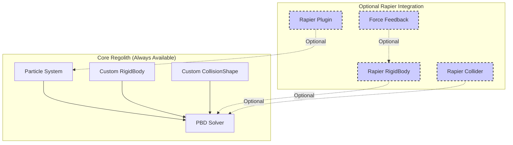
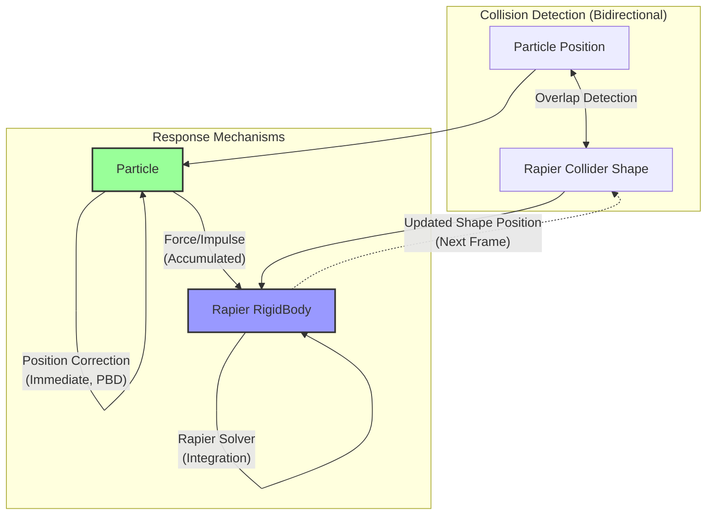
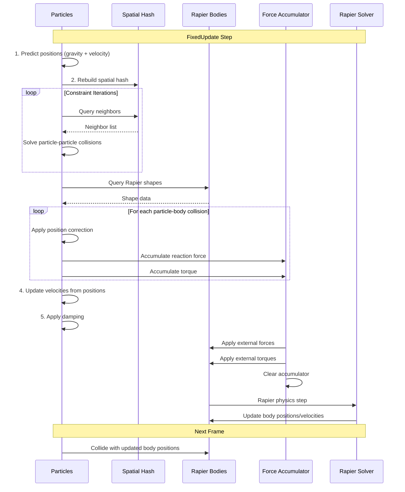

# Rapier Integration Strategy for Bevy Regolith

## Overview

This document describes the **optional** integration strategy between the PBD granular particle system and Rapier physics engine. The goal is to enable bidirectional interaction between granular particles and rigid bodies while:

1. **Keeping Rapier optional** - The plugin works standalone without Rapier
2. **Maintaining custom collision system** - Your existing [`RigidBody`](../src/rigid_body.rs) and [`CollisionShape`](../src/rigid_body.rs) components remain functional
3. **Preserving GPU migration path** - Particles stay in custom ECS components

## Design Philosophy: Optional Integration

The integration is designed as an **opt-in feature** using Bevy's conditional compilation and runtime detection:



### Key Principles

1. **Particles are NOT Rapier colliders** - They remain in custom ECS components for GPU migration
2. **Custom collision system remains default** - Works without Rapier dependency
3. **Rapier integration is additive** - Adds force feedback when Rapier is present
4. **Dual collision support** - Can handle both custom and Rapier rigid bodies simultaneously

## Architecture Philosophy

### One-Way Force Coupling

The term "one-way force coupling" refers to the **force feedback mechanism**, not collision response:



### Collision System Modes

The system supports three operational modes:

1. **Custom Only** (Default): Uses your existing [`RigidBody`](../src/rigid_body.rs) and [`CollisionShape`](../src/rigid_body.rs) components
2. **Rapier Only**: Uses Rapier components with force feedback
3. **Hybrid**: Supports both custom and Rapier rigid bodies simultaneously

```rust
// Mode 1: Custom Only (no Rapier dependency)
commands.spawn(RigidBodyBundle::static_box(
    Vec3::ZERO, Quat::IDENTITY, 10.0, 5.0, 10.0
));

// Mode 2: Rapier Only (requires bevy_rapier3d)
commands.spawn((
    RapierRigidBody::Fixed,
    RapierCollider::cuboid(5.0, 2.5, 5.0),
    Transform::default(),
    ParticleInteractive::static_body(),
));

// Mode 3: Hybrid (both in same scene)
// Both types of rigid bodies work together!
```

## Current Implementation Status

The existing [`collision.rs`](../src/collision.rs) system (lines 74-225) already implements:
- ✅ Particle-rigid body collision detection
- ✅ Position correction to prevent penetration
- ✅ Swept collision detection for fast-moving particles
- ❌ Force feedback to Rapier bodies (missing)

## Integration Components

### 1. Marker Component

```rust
/// Marks Rapier rigid bodies that interact with granular particles
#[derive(Component, Clone)]
pub struct ParticleInteractive {
    /// Coefficient of restitution for particle collisions (0.0 = no bounce, 1.0 = perfect bounce)
    pub restitution: f32,
    
    /// Friction coefficient for particle sliding
    pub friction: f32,
    
    /// Whether particles can apply forces to move this body
    /// Set to false for static/kinematic bodies that should only block particles
    pub dynamic_response: bool,
    
    /// Force multiplier for tuning particle impact strength
    pub force_scale: f32,
}

impl Default for ParticleInteractive {
    fn default() -> Self {
        Self {
            restitution: 0.0,
            friction: 0.5,
            dynamic_response: true,
            force_scale: 1.0,
        }
    }
}

impl ParticleInteractive {
    /// Create for a static body (blocks particles but doesn't move)
    pub fn static_body() -> Self {
        Self {
            dynamic_response: false,
            ..Default::default()
        }
    }
    
    /// Create for a dynamic body (can be pushed by particles)
    pub fn dynamic_body(restitution: f32, friction: f32) -> Self {
        Self {
            restitution,
            friction,
            dynamic_response: true,
            force_scale: 1.0,
        }
    }
}
```

### 2. Force Accumulator Resource

```rust
use std::collections::HashMap;
use bevy::prelude::*;

/// Accumulates forces and torques from particle collisions before applying to Rapier
#[derive(Resource, Default)]
pub struct ParticleForceAccumulator {
    /// Forces to apply to rigid body centers of mass
    pub forces: HashMap<Entity, Vec3>,
    
    /// Torques to apply to rigid bodies
    pub torques: HashMap<Entity, Vec3>,
    
    /// Number of particle contacts per body (for debugging/visualization)
    pub contact_counts: HashMap<Entity, usize>,
}

impl ParticleForceAccumulator {
    pub fn clear(&mut self) {
        self.forces.clear();
        self.torques.clear();
        self.contact_counts.clear();
    }
    
    pub fn add_force(&mut self, entity: Entity, force: Vec3, contact_point: Vec3, body_center: Vec3) {
        *self.forces.entry(entity).or_default() += force;
        
        // Calculate torque from contact point
        let r = contact_point - body_center;
        let torque = r.cross(force);
        *self.torques.entry(entity).or_default() += torque;
        
        *self.contact_counts.entry(entity).or_default() += 1;
    }
}
```

## System Implementation

### Phase 1: Collision Detection & Particle Response

This phase is **already implemented** in [`collision.rs`](../src/collision.rs:74-225). The system:

1. Queries Rapier rigid bodies with collision shapes
2. For each particle, checks collision with each rigid body
3. Applies position correction to particles (PBD constraint projection)
4. Uses swept collision detection for fast-moving particles

**Current code structure:**
```rust
pub fn solve_constraints(
    mut particles: Query<(Entity, &mut ParticlePosition, &ParticlePrevPosition, ...)>,
    rigid_bodies: Query<(&Transform, &CollisionShape, &RigidBody)>,
    // ...
) {
    for _ in 0..config.iterations {
        // Particle-particle collisions (lines 28-65)
        // ...
        
        // Particle-rigid body collisions (lines 74-225)
        for (_, mut pos, prev_pos, radius, _, _) in particles.iter_mut() {
            for (rb_transform, shape, _rb) in rigid_bodies.iter() {
                // Swept collision detection (lines 81-180)
                // Standard collision check (lines 184-223)
                // Position correction applied to particle
            }
        }
    }
}
```

### Phase 2: Force Calculation & Accumulation (NEW)

This phase needs to be added to calculate and accumulate forces on Rapier bodies:

```rust
use bevy::prelude::*;
use bevy_rapier3d::prelude::*;

/// Modified collision system that also accumulates forces for Rapier bodies
pub fn solve_particle_rapier_constraints(
    mut particles: Query<(
        Entity,
        &mut ParticlePosition,
        &ParticlePrevPosition,
        &ParticleRadius,
        &ParticleMass,
    )>,
    // Replace custom RigidBody with Rapier components
    rapier_bodies: Query<(
        Entity,
        &RapierRigidBody,
        &RapierCollider,
        &GlobalTransform,
        &ParticleInteractive,
    )>,
    mut force_accumulator: ResMut<ParticleForceAccumulator>,
    config: Res<SolverConfig>,
) {
    // Clear previous frame's forces
    force_accumulator.clear();
    
    for _ in 0..config.iterations {
        for (particle_entity, mut pos, prev_pos, radius, mass) in particles.iter_mut() {
            // Store velocity before collision
            let velocity_before = (pos.0 - prev_pos.0) / config.dt;
            
            for (rb_entity, _rb, collider, transform, interactive) in rapier_bodies.iter() {
                // Get Rapier shape
                let shape = collider.shape();
                let rb_transform = transform.compute_transform();
                
                // Collision detection using Rapier's utilities
                if let Some(contact) = query_particle_shape_contact(
                    pos.0,
                    radius.0,
                    shape,
                    rb_transform,
                ) {
                    // 1. Apply position correction to particle (PBD style)
                    let correction = contact.normal * contact.penetration;
                    pos.0 += correction;
                    
                    // 2. Calculate force on rigid body (if dynamic)
                    if interactive.dynamic_response {
                        // Velocity after collision (from position change)
                        let velocity_after = (pos.0 - prev_pos.0) / config.dt;
                        
                        // Change in momentum = impulse
                        let delta_velocity = velocity_after - velocity_before;
                        let impulse = mass.0 * delta_velocity;
                        
                        // Convert impulse to force (F = impulse / dt)
                        let force = impulse / config.dt;
                        
                        // Apply restitution (bounciness)
                        let normal_velocity = velocity_before.dot(contact.normal);
                        if normal_velocity < 0.0 {
                            let restitution_impulse = -normal_velocity * interactive.restitution * mass.0;
                            let restitution_force = contact.normal * restitution_impulse / config.dt;
                            force += restitution_force;
                        }
                        
                        // Scale force
                        let scaled_force = force * interactive.force_scale;
                        
                        // Accumulate force and torque
                        // Newton's 3rd law: force on body is opposite to force on particle
                        force_accumulator.add_force(
                            rb_entity,
                            -scaled_force,
                            contact.point,
                            rb_transform.translation,
                        );
                    }
                }
            }
        }
    }
}
```

### Phase 3: Force Application to Rapier (NEW)

Apply accumulated forces to Rapier's external force system:

```rust
use bevy::prelude::*;
use bevy_rapier3d::prelude::*;

/// Apply accumulated particle forces to Rapier rigid bodies
pub fn apply_particle_forces_to_rapier(
    force_accumulator: Res<ParticleForceAccumulator>,
    mut external_forces: Query<&mut ExternalForce>,
    mut external_impulses: Query<&mut ExternalImpulse>,
) {
    for (entity, force) in force_accumulator.forces.iter() {
        // Apply force (continuous)
        if let Ok(mut ext_force) = external_forces.get_mut(*entity) {
            ext_force.force += *force;
            
            // Apply torque
            if let Some(torque) = force_accumulator.torques.get(entity) {
                ext_force.torque += *torque;
            }
        }
    }
}

/// Alternative: Apply as impulses for more stable behavior with large particle counts
pub fn apply_particle_impulses_to_rapier(
    force_accumulator: Res<ParticleForceAccumulator>,
    mut external_impulses: Query<&mut ExternalImpulse>,
    config: Res<SolverConfig>,
) {
    for (entity, force) in force_accumulator.forces.iter() {
        if let Ok(mut ext_impulse) = external_impulses.get_mut(*entity) {
            // Convert force to impulse: impulse = force * dt
            let impulse = *force * config.dt;
            ext_impulse.impulse += impulse;
            
            // Apply angular impulse
            if let Some(torque) = force_accumulator.torques.get(entity) {
                let angular_impulse = *torque * config.dt;
                ext_impulse.torque_impulse += angular_impulse;
            }
        }
    }
}
```

## Collision Detection Helper

Utility function for querying particle-shape contacts using Rapier:

```rust
use bevy::prelude::*;
use bevy_rapier3d::prelude::*;
use rapier3d::prelude::*;

pub struct ParticleContact {
    /// Contact point in world space
    pub point: Vec3,
    
    /// Contact normal pointing away from shape (towards particle)
    pub normal: Vec3,
    
    /// Penetration depth (positive = overlapping)
    pub penetration: f32,
}

/// Query contact between a particle (sphere) and a Rapier shape
pub fn query_particle_shape_contact(
    particle_pos: Vec3,
    particle_radius: f32,
    shape: &dyn Shape,
    shape_transform: Transform,
) -> Option<ParticleContact> {
    // Convert to Rapier types
    let particle_isometry = Isometry::translation(
        particle_pos.x,
        particle_pos.y,
        particle_pos.z,
    );
    
    let shape_isometry = Isometry::from_parts(
        Translation::from(shape_transform.translation.into()),
        shape_transform.rotation.into(),
    );
    
    // Create ball shape for particle
    let ball = Ball::new(particle_radius);
    
    // Query contact using Rapier's collision detection
    match query::contact(
        &particle_isometry,
        &ball,
        &shape_isometry,
        shape,
        0.0, // prediction distance
    ) {
        Ok(Some(contact)) => {
            Some(ParticleContact {
                point: Vec3::from(contact.point1),
                normal: Vec3::from(contact.normal1),
                penetration: -contact.dist, // negative dist = penetration
            })
        }
        _ => None,
    }
}
```

## Optional Cargo Feature

Add Rapier as an optional dependency in `Cargo.toml`:

```toml
[dependencies]
bevy = "0.14"
# ... other dependencies

# Optional Rapier integration
bevy_rapier3d = { version = "0.27", optional = true }

[features]
default = []
rapier = ["bevy_rapier3d"]
```

## System Ordering & Plugin Integration

The plugin automatically detects if Rapier is available and registers appropriate systems:

```rust
use bevy::prelude::*;

// Conditional import
#[cfg(feature = "rapier")]
use bevy_rapier3d::prelude::*;

impl Plugin for RegolithPlugin {
    fn build(&self, app: &mut App) {
        app
            // Core resources (always present)
            .init_resource::<SolverConfig>()
            .init_resource::<MaterialRegistry>()
            .init_resource::<SpatialHash>()
            
            // Startup systems
            .add_systems(Startup, (
                setup_materials,
                spawner::setup_initial_particles,
            ).chain())
            
            // Update systems
            .add_systems(Update, (
                spawner::handle_spawn_input,
                camera::orbit_camera_system,
                rendering::setup_particle_rendering,
                ui::update_ui,
            ))
            
            // Core physics systems (always run)
            .add_systems(FixedUpdate, (
                solver::predict_positions,
                solver::rebuild_spatial_hash,
                collision::solve_particle_particle_constraints,
                collision::solve_constraints, // Custom rigid body collisions
                solver::update_velocities,
                solver::apply_damping,
            ).chain());
        
        // Optional Rapier integration
        #[cfg(feature = "rapier")]
        {
            app
                .init_resource::<ParticleForceAccumulator>()
                .add_systems(FixedUpdate, (
                    collision::solve_particle_rapier_constraints,
                ).after(collision::solve_constraints)
                 .before(PhysicsSet::SyncBackend))
                .add_systems(FixedUpdate,
                    collision::apply_particle_forces_to_rapier
                        .after(collision::solve_particle_rapier_constraints)
                        .before(PhysicsSet::StepSimulation)
                );
        }
        
        app
            // Late update (rendering)
            .add_systems(Update, rendering::update_particle_transforms)
            .add_systems(Update, debug::debug_draw_system);
    }
}
```

## Unified Collision System

The collision system handles both custom and Rapier rigid bodies:

```rust
/// Unified collision system that handles both custom and Rapier rigid bodies
pub fn solve_constraints(
    mut particles: Query<(
        Entity,
        &mut ParticlePosition,
        &ParticlePrevPosition,
        &ParticleRadius,
        &ParticleMass,
    )>,
    // Custom rigid bodies (always available)
    custom_bodies: Query<(&Transform, &CollisionShape, &RigidBody)>,
    // Rapier bodies (only when feature enabled)
    #[cfg(feature = "rapier")]
    rapier_bodies: Query<(
        Entity,
        &RapierRigidBody,
        &RapierCollider,
        &GlobalTransform,
        Option<&ParticleInteractive>,
    )>,
    #[cfg(feature = "rapier")]
    mut force_accumulator: ResMut<ParticleForceAccumulator>,
    config: Res<SolverConfig>,
) {
    #[cfg(feature = "rapier")]
    force_accumulator.clear();
    
    for _ in 0..config.iterations {
        // Particle-particle collisions
        // ... (existing code)
        
        // Custom rigid body collisions (always run)
        for (_, mut pos, prev_pos, radius, _) in particles.iter_mut() {
            for (rb_transform, shape, _rb) in custom_bodies.iter() {
                // Your existing collision detection code
                // ... (lines 74-225 from current collision.rs)
            }
        }
        
        // Rapier rigid body collisions (only if feature enabled)
        #[cfg(feature = "rapier")]
        {
            for (_, mut pos, prev_pos, radius, mass) in particles.iter_mut() {
                let velocity_before = (pos.0 - prev_pos.0) / config.dt;
                
                for (rb_entity, _rb, collider, transform, interactive) in rapier_bodies.iter() {
                    let shape = collider.shape();
                    let rb_transform = transform.compute_transform();
                    
                    if let Some(contact) = query_particle_shape_contact(
                        pos.0, radius.0, shape, rb_transform
                    ) {
                        // Apply position correction
                        pos.0 += contact.normal * contact.penetration;
                        
                        // Accumulate forces if interactive
                        if let Some(interactive) = interactive {
                            if interactive.dynamic_response {
                                let velocity_after = (pos.0 - prev_pos.0) / config.dt;
                                let delta_v = velocity_after - velocity_before;
                                let force = mass.0 * delta_v / config.dt;
                                
                                force_accumulator.add_force(
                                    rb_entity,
                                    -force * interactive.force_scale,
                                    contact.point,
                                    rb_transform.translation,
                                );
                            }
                        }
                    }
                }
            }
        }
    }
}
```

## Complete Frame Timeline



## Usage Examples

### Example 1: Custom Rigid Bodies Only (No Rapier)

```rust
use bevy::prelude::*;
use bevy_regolith::prelude::*;

fn main() {
    App::new()
        .add_plugins(DefaultPlugins)
        .add_plugins(RegolithPlugin) // No Rapier dependency!
        .add_systems(Startup, setup)
        .run();
}

fn setup(mut commands: Commands) {
    // Spawn particles
    commands.spawn(ParticleBundle::new(
        Vec3::new(0.0, 5.0, 0.0),
        0, // material_id
        0.05, // radius
        0.01, // mass
    ));
    
    // Spawn custom rigid body (always works)
    commands.spawn(RigidBodyBundle::static_box(
        Vec3::new(0.0, -1.0, 0.0),
        Quat::IDENTITY,
        10.0, 2.0, 10.0,
    ));
}
```

### Example 2: Rapier Integration (With Feature)

```toml
# Cargo.toml
[dependencies]
bevy_regolith = { version = "0.1", features = ["rapier"] }
bevy_rapier3d = "0.27"
```

```rust
use bevy::prelude::*;
use bevy_regolith::prelude::*;
use bevy_rapier3d::prelude::*;

fn main() {
    App::new()
        .add_plugins(DefaultPlugins)
        .add_plugins(RapierPhysicsPlugin::<NoUserData>::default())
        .add_plugins(RegolithPlugin) // Automatically detects Rapier
        .add_systems(Startup, setup)
        .run();
}

fn setup(mut commands: Commands) {
    // Spawn particles
    commands.spawn(ParticleBundle::new(
        Vec3::new(0.0, 5.0, 0.0),
        0, 0.05, 0.01,
    ));
    
    // Spawn Rapier rigid body with particle interaction
    commands.spawn((
        RigidBody::Dynamic,
        Collider::cuboid(0.5, 0.5, 0.5),
        TransformBundle::from_transform(
            Transform::from_translation(Vec3::new(0.0, 2.0, 0.0))
        ),
        ParticleInteractive::dynamic_body(0.3, 0.5),
    ));
}
```

### Example 3: Hybrid Mode (Both Systems)

```rust
fn setup(mut commands: Commands) {
    // Custom rigid body (static ground)
    commands.spawn(RigidBodyBundle::static_box(
        Vec3::new(0.0, -1.0, 0.0),
        Quat::IDENTITY,
        20.0, 2.0, 20.0,
    ));
    
    // Rapier rigid body (dynamic object that particles can push)
    #[cfg(feature = "rapier")]
    commands.spawn((
        RigidBody::Dynamic,
        Collider::ball(0.5),
        TransformBundle::from_transform(
            Transform::from_translation(Vec3::new(0.0, 3.0, 0.0))
        ),
        ParticleInteractive::dynamic_body(0.2, 0.6),
    ));
    
    // Particles interact with both!
    for i in 0..100 {
        commands.spawn(ParticleBundle::new(
            Vec3::new(
                (i as f32 * 0.1) - 5.0,
                5.0,
                0.0,
            ),
            0, 0.05, 0.01,
        ));
    }
}
```

## Migration Strategies

### Strategy 1: Keep Custom System (Recommended for Simple Cases)

If you don't need complex rigid body dynamics:
- ✅ No additional dependencies
- ✅ Simpler codebase
- ✅ Faster compilation
- ✅ Full control over collision shapes

### Strategy 2: Gradual Migration to Rapier

For projects that need advanced physics:
1. Enable `rapier` feature
2. Add Rapier plugin to your app
3. Gradually replace custom rigid bodies with Rapier bodies
4. Keep custom bodies for simple static geometry
5. Use Rapier for dynamic objects that need realistic physics

### Strategy 3: Hybrid Approach (Best of Both Worlds)

Use both systems simultaneously:
- Custom bodies for static environment (walls, floors, terrain)
- Rapier bodies for dynamic objects (boxes, spheres that particles can push)
- Particles interact seamlessly with both

## Performance Optimization

### Spatial Query Optimization

For scenes with many Rapier bodies, use spatial queries to only check nearby bodies:

```rust
pub fn solve_particle_rapier_constraints_optimized(
    mut particles: Query<(Entity, &mut ParticlePosition, &ParticleRadius, &ParticleMass)>,
    rapier_context: Res<RapierContext>,
    rapier_bodies: Query<(&GlobalTransform, &ParticleInteractive)>,
    mut force_accumulator: ResMut<ParticleForceAccumulator>,
    config: Res<SolverConfig>,
) {
    force_accumulator.clear();
    
    for (particle_entity, mut pos, radius, mass) in particles.iter_mut() {
        let mut nearby_colliders = Vec::new();
        
        // Use Rapier's spatial query to find nearby colliders
        rapier_context.intersections_with_shape(
            pos.0.into(),
            Quat::IDENTITY.into(),
            &Ball::new(radius.0 * 3.0), // Query radius
            QueryFilter::default(),
            |collider_entity| {
                nearby_colliders.push(collider_entity);
                true // Continue checking
            },
        );
        
        // Only process nearby colliders
        for collider_entity in nearby_colliders {
            if let Ok((transform, interactive)) = rapier_bodies.get(collider_entity) {
                // Perform collision detection and force calculation
                // ...
            }
        }
    }
}
```

### Batch Force Application

For better cache performance with many particles:

```rust
// Collect all forces first
let mut force_batch: Vec<(Entity, Vec3, Vec3)> = Vec::new();

for (entity, force) in force_accumulator.forces.iter() {
    if let Some(torque) = force_accumulator.torques.get(entity) {
        force_batch.push((*entity, *force, *torque));
    }
}

// Apply in batch
for (entity, force, torque) in force_batch {
    if let Ok(mut ext_force) = external_forces.get_mut(entity) {
        ext_force.force += force;
        ext_force.torque += torque;
    }
}
```

## GPU Migration Path

The integration strategy preserves GPU migration capability:

### Phase 1: CPU Prototype (Current)
- Particles in Bevy ECS components
- CPU-based PBD solver
- Rapier on CPU

### Phase 2: GPU Compute
- Particles in GPU buffers
- GPU compute shaders for PBD
- Rapier still on CPU
- CPU-GPU sync for collision detection

### Phase 3: Optimized Hybrid
- Particles fully on GPU
- Minimal CPU-GPU sync
- Only sync particle positions near Rapier bodies
- Use compute shader for force accumulation

```rust
// Future GPU integration pseudocode
#[derive(Resource)]
struct GpuParticleBuffers {
    positions: Buffer,
    velocities: Buffer,
    // ... other particle data
}

fn gpu_particle_rapier_collision(
    gpu_particles: Res<GpuParticleBuffers>,
    rapier_bodies: Query<(Entity, &RapierCollider, &GlobalTransform)>,
    // Dispatch compute shader that:
    // 1. Reads Rapier collider data
    // 2. Performs collision detection on GPU
    // 3. Writes force accumulation to GPU buffer
    // 4. CPU reads back forces and applies to Rapier
) {
    // Implementation details...
}
```

## Testing & Validation

### Test Scenarios

1. **Static Body Test**: Particles pile up on static Rapier box
2. **Dynamic Body Test**: Particles push a dynamic Rapier sphere
3. **Tipping Test**: Particle stream tips over a tall Rapier box
4. **Friction Test**: Particles slide down an angled Rapier plane
5. **Restitution Test**: Particles bounce off high-restitution surface

### Debug Visualization

Add debug rendering for force feedback:

```rust
pub fn debug_draw_particle_forces(
    mut gizmos: Gizmos,
    force_accumulator: Res<ParticleForceAccumulator>,
    transforms: Query<&GlobalTransform>,
) {
    for (entity, force) in force_accumulator.forces.iter() {
        if let Ok(transform) = transforms.get(*entity) {
            let pos = transform.translation();
            let force_scale = 0.001; // Scale for visualization
            
            // Draw force vector
            gizmos.arrow(
                pos,
                pos + *force * force_scale,
                Color::RED,
            );
            
            // Draw torque (if present)
            if let Some(torque) = force_accumulator.torques.get(entity) {
                gizmos.circle(
                    pos,
                    Direction3d::new_unchecked(torque.normalize()),
                    torque.length() * force_scale,
                    Color::BLUE,
                );
            }
        }
    }
}
```

## Tuning Parameters

### Force Scale
- Start with `force_scale: 1.0`
- Increase if particles don't affect bodies enough
- Decrease if bodies react too violently

### Restitution
- `0.0`: No bounce (particles stick/slide)
- `0.3-0.5`: Realistic granular behavior
- `1.0`: Perfect elastic collision (unrealistic for granular)

### Friction
- `0.0`: Frictionless (particles slide freely)
- `0.5`: Moderate friction (realistic for most materials)
- `1.0`: High friction (particles grip strongly)

### Solver Iterations
- More iterations = more accurate but slower
- 5-10 iterations typically sufficient
- Increase if particles penetrate bodies

## Known Limitations

### General
1. **One-way coupling**: Rapier body velocities don't directly affect particle velocities (only through collision response)
2. **Force accumulation**: Forces are accumulated over constraint iterations, may need tuning
3. **Performance**: CPU collision detection between all particles and all rigid bodies can be expensive
4. **Stability**: Large particle counts or high velocities may require smaller timesteps

### Rapier-Specific (when feature enabled)
1. **Compile time**: Adding Rapier increases compilation time
2. **Binary size**: Rapier adds ~2-3MB to binary size
3. **Feature flag**: Must enable `rapier` feature to use Rapier integration
4. **API differences**: Rapier and custom collision shapes have different APIs

## Future Enhancements

1. **Velocity coupling**: Transfer Rapier body velocities to nearby particles
2. **Buoyancy**: Particles create buoyancy forces on submerged bodies
3. **Drag**: Particles create drag forces on moving bodies
4. **GPU acceleration**: Move collision detection to GPU compute shaders
5. **Spatial partitioning**: Use Rapier's spatial queries more extensively

## Decision Guide: When to Use Rapier?

### Use Custom System When:
- ✅ You only need static collision geometry
- ✅ You want minimal dependencies
- ✅ You're prototyping or learning
- ✅ You need maximum control over collision detection
- ✅ Binary size is a concern

### Add Rapier When:
- ✅ You need realistic rigid body dynamics
- ✅ You want bodies to interact with each other (not just particles)
- ✅ You need joints, constraints, or complex physics
- ✅ You want particles to push/tip/move dynamic objects
- ✅ You're building a physics-heavy simulation

### Use Hybrid When:
- ✅ You have simple static geometry (custom) + complex dynamics (Rapier)
- ✅ You want to optimize performance (custom for static, Rapier for dynamic)
- ✅ You're gradually migrating from custom to Rapier
- ✅ You need the best of both worlds

## References

- [Rapier Documentation](https://rapier.rs/)
- [Position Based Dynamics](https://matthias-research.github.io/pages/publications/posBasedDyn.pdf)
- [Bevy Rapier Plugin](https://github.com/dimforge/bevy_rapier)
- [Bevy Optional Dependencies](https://bevy-cheatbook.github.io/features/cargo.html)
- Current implementation: [`collision.rs`](../src/collision.rs), [`solver.rs`](../src/solver.rs), [`rigid_body.rs`](../src/rigid_body.rs)